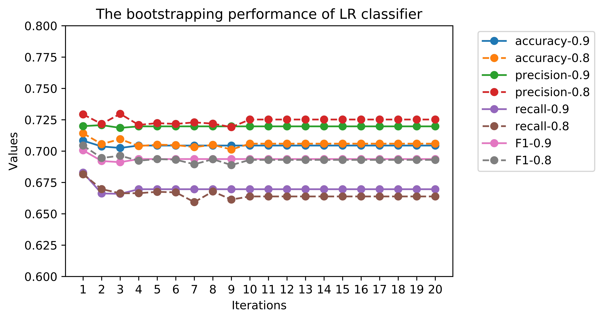

<!--
1. Bootstrapping Overview
2. Bootstrapping performance
 -->

The target of this week is to 1) introduce the idea of bootstrapping; 2) apply bootstrapping on a simple classifier, i.e. Logistic Regression; 3) evaluate the effectiveness of bootstrapping in the learning steps.


# Overview of Bootstrapping

The supervised machine learning needs a lot of labeled data, while it is difficult to achieve if we start from some snippet in reality. Since we have recognized some high-precision seed pairs of causality relations. It is enough to bootstrap a classifier

In the task of semi-supervised relation extraction, bootstrapping proceeds by considering the entities in the seed pairs, tagging those sentences that contain both entities and generalizing the context around the entities to learn new patterns [<sup>1</sup>](#refer-anchor-1).

However, before we go deep into the discussed step, it is really interesting to check whether the recursively addition of positive examples could result in better performance of a classifier. It will be the focus of this week's blog.


# Bootstrapping Application
## Data processing procedures
At first, it is necessary to acknowledge the data processing procedures of bootstrapping. In our experiment, for the same dataset, we apply bootstrapping with a classifier for *20 rounds*. For each round, the dataset splits into 10 consecutive folds (with shuffling), where **two folds** is used as *test set* and the **eight remaining folds** forms the *train set*. Thus each round triggers 10 iterations with different splitting ways.

## Learning rate
As we discussed, for each time we got a trained classifier in one round, we expect to include the predicating positive examples in next round. To do so, first we need to set a *learning rate*, also a threshold, to examine which examples are positive (exceeding learning rate) and negative (lower than learning rate). In our experiment, we set the learning rate as 0.9 and 0.8 as comparison.


# Bootstrapping Performance




Imagine you want to classify what kind of event is happening at every point in a movie. It’s unclear how a traditional neural network could use its reasoning about previous events in the film to inform later ones. **Recurrent neural networks (RNN)** address this issue. They are networks with loops in them, allowing information to persist [<sup>1</sup>](#refer-anchor-1).

**Long Short Term Memory (LSTM)** is a special kind of RNN, capable of learning long-term dependencies. It is firstly introduced by Hochreiter & Schmidhuber (1997)[<sup>2</sup>](#refer-anchor-2). LSTM is explicitly designed to avoid the long-term dependency problem.


## Getting feature array of inputting text

Before proceeding, we define the feature arrays into three parts of each entry.

```python
def get_feature_arrays(df: pd.DataFrame) -> Tuple[np.ndarray, np.ndarray, np.ndarray]:

    """Get np arrays of upto max_length tokens and person idxs."""
    bet = df.text_between
    left = df.ele1_left_tokens
    right = df.ele2_right_tokens

    def pad_or_truncate(l, max_length=40):
        return l[:max_length] + [""] * (max_length - len(l))

    left_tokens = np.array(list(map(pad_or_truncate, left)))
    bet_tokens = np.array(list(map(pad_or_truncate, bet)))
    right_tokens = np.array(list(map(pad_or_truncate, right)))
    return left_tokens, bet_tokens, right_tokens

```

## Parameters of LSTM
```python

import tensorflow as tf
from tensorflow.keras.layers import (
    Bidirectional,
    Concatenate,
    Dense,
    Embedding,
    Input,
    LSTM,)


def bilstm(
    tokens: tf.Tensor,
    rnn_state_size: int = 64,
    num_buckets: int = 40000,
    embed_dim: int = 36,):

    ids = tf.strings.to_hash_bucket(tokens, num_buckets)
    embedded_input = Embedding(num_buckets, embed_dim)(ids)
    return Bidirectional(LSTM(rnn_state_size, activation=tf.nn.relu))(
        embedded_input, mask=tf.strings.length(tokens))


def get_model(
    rnn_state_size: int = 64, num_buckets: int = 40000, embed_dim: int = 12
) -> tf.keras.Model:
    """
    Return LSTM model for predicting label probabilities.
    Args:
        rnn_state_size: LSTM state size.
        num_buckets: Number of buckets to hash strings to integers.
        embed_dim: Size of token embeddings.
    Returns:
        model: A compiled LSTM model.
    """
    left_ph = Input((None,), dtype="string")
    bet_ph = Input((None,), dtype="string")
    right_ph = Input((None,), dtype="string")
    left_embs = bilstm(left_ph, rnn_state_size, num_buckets, embed_dim)
    bet_embs = bilstm(bet_ph, rnn_state_size, num_buckets, embed_dim)
    right_embs = bilstm(right_ph, rnn_state_size, num_buckets, embed_dim)
    layer = Concatenate(1)([left_embs, bet_embs, right_embs])
    layer = Dense(64, activation=tf.nn.relu)(layer)
    layer = Dense(32, activation=tf.nn.relu)(layer)
    probabilities = Dense(2, activation=tf.nn.softmax)(layer)
    model = tf.keras.Model(inputs=[bet_ph, left_ph, right_ph], outputs=probabilities)
    model.compile(tf.train.AdagradOptimizer(0.1), "categorical_crossentropy")
    return model


    ### Training our End classification Model (LSTM)
    X_train = get_feature_arrays(df_train)
    model = get_model()
    batch_size = 64
    model.fit(X_train, probs_train_filtered, batch_size=batch_size, epochs=get_n_epochs())

```


# Evaluate the classification model

```python
### Evaluating the trained model(LSTM) on the test set
X_test = get_feature_arrays(df_test)
probs_test = model.predict(X_test)
preds_test = probs_to_preds(probs_test)
```

The results show:
> Test **accuracy** when trained with soft labels: 0.9967462832074092
>
> Test **precision** when trained with soft labels: 0.0
>
> Test **recall** when trained with soft labels: 0.0
>
> Test **F1** when trained with soft labels: 0.0
>
> Test **ROC-AUC** when trained with soft labels: 0.5355835641424763


We found that the accuracy is really high, but the precision, recall and F-1 are rather low. In the future plan, we plan to decrease the number of negative samples and apply with a simple classification model (i.e. logistic regression).


## Reference

<div id="refer-anchor-1"></div>
[1] [Information Extraction. Speech and Language Processing. Daniel Jurafsky & James H. Martin. Copyright © 2020. All
rights reserved. Draft of December 30, 2020.](https://web.stanford.edu/~jurafsky/slp3/17.pdf)


<div id="refer-anchor-2"></div>
[2][Hochreiter, S., & Schmidhuber, J. (1997). Long short-term memory. Neural computation, 9(8), 1735-1780.](http://www.bioinf.jku.at/publications/older/2604.pdf)
